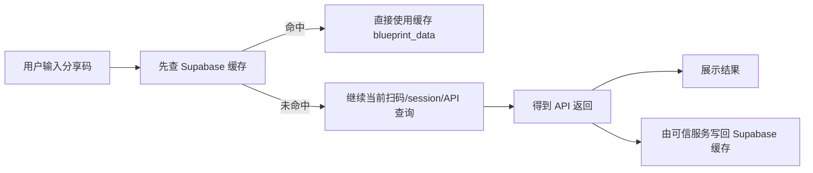

# Supabase 蓝图缓存接入计划

日期：2026-06-04

## 背景

你为项目创建的 Supabase 项目地址：

```text
https://bykzldmcqzgpmwjjpdtl.supabase.co
```

当前本地项目是 `Vite 8 + Vite+ + Vue 3 + TypeScript` 单页工具。分享码查询逻辑集中在：

- `src/features/blueprint/composables/useBlueprintParser.ts`
- `src/features/blueprint/composables/useShareQuerySession.ts`
- `src/features/blueprint/services/shareQuery/sessionClient.ts`

当前流程是：


目标流程是：



## Supabase 项目连接状态

本项目 Supabase 数据库为：

```text
https://bykzldmcqzgpmwjjpdtl.supabase.co
```

已添加 Codex MCP 连接：

```bash
codex mcp add supabase --url "https://mcp.supabase.com/mcp?project_ref=bykzldmcqzgpmwjjpdtl"
```

本机 `codex mcp list` 已显示 `supabase` 指向 `project_ref=bykzldmcqzgpmwjjpdtl`。如果当前 Codex 线程中的 `mcp__supabase.get_project_url` 仍返回旧项目，说明 MCP 运行实例尚未刷新；执行迁移、Edge Function 部署或远端查询前，需要重新加载 MCP/新开线程后再次校验 URL。

`musbqvjgtgetlouwsoxk.supabase.co` 是另一个 Supabase 项目，不作为本项目依据。

当前还需要你补齐：

- Supabase publishable key，用于前端只读查询缓存。
- Supabase secret key 或 service role key，只能放在 Supabase Edge Function、Vercel Function、后端服务或 CI secret 中，不能进入浏览器代码。
- 确认本项目是否已经创建 `blueprint_cache` 表；如果没有，需要按本文数据库迁移方案创建。
- 是否允许匿名用户读取缓存。按当前项目无登录体系，推荐允许匿名读取 `ready` 状态缓存。

## 最佳架构建议

推荐采用 **前端可读、可信服务写入**：

- 前端使用 publishable key 查询 `blueprint_cache`。
- `blueprint_cache` 开启 RLS。
- 匿名用户只允许 `select` 已验证、未过期的缓存。
- 匿名用户不允许 `insert/update/delete`。
- 缓存 miss 后仍走现有扫码和 API 查询。
- API 查询成功后，写回缓存必须通过可信服务完成。

不推荐让浏览器用 anon/publishable key 直接写缓存。原因是任何人都可以伪造分享码和 JSON，把错误蓝图提前写进去，造成缓存污染。

## 推荐数据库结构

表名：`public.blueprint_cache`

缓存键规范：

- 所有查询、写回和测试都先调用同一个 `normalizeShareCode(shareCode)`。
- 至少处理首尾空白、换行、用户粘贴的 URL/文本包装，并校验分享码格式。
- 不在未确认上游规则前强制大小写转换，避免把大小写敏感的分享码合并。
- Supabase 表中只保存规范化后的 `share_code`，前端展示仍可保留用户原始输入。

```sql
create table public.blueprint_cache (
  share_code text primary key,
  raw_response jsonb not null,
  source text not null default 'upstream_api',
  status text not null default 'ready',
  parser_version text not null default '1',
  response_hash text,
  hit_count integer not null default 0,
  first_cached_at timestamptz not null default now(),
  last_accessed_at timestamptz,
  last_refreshed_at timestamptz not null default now(),
  expires_at timestamptz,
  created_at timestamptz not null default now(),
  updated_at timestamptz not null default now(),
  constraint blueprint_cache_has_data check (raw_response ? 'blueprint_data'),
  constraint blueprint_cache_status check (status in ('ready', 'stale', 'failed'))
);

create index blueprint_cache_status_expires_idx
  on public.blueprint_cache (status, expires_at);

create index blueprint_cache_refreshed_idx
  on public.blueprint_cache (last_refreshed_at desc);

alter table public.blueprint_cache enable row level security;

grant select on public.blueprint_cache to anon;
grant select on public.blueprint_cache to authenticated;
grant select, insert, update, delete on public.blueprint_cache to service_role;

create policy "Public can read ready blueprint cache"
on public.blueprint_cache
for select
to anon, authenticated
using (
  status = 'ready'
  and (expires_at is null or expires_at > now())
);

create or replace function public.set_blueprint_cache_updated_at()
returns trigger
language plpgsql
set search_path = pg_catalog
as $$
begin
  new.updated_at = now();
  return new;
end;
$$;

revoke all on function public.set_blueprint_cache_updated_at() from public;

create trigger blueprint_cache_set_updated_at
before update on public.blueprint_cache
for each row
execute function public.set_blueprint_cache_updated_at();
```

可选审计表：

```sql
create table public.blueprint_cache_events (
  id bigint generated always as identity primary key,
  share_code text not null,
  event_type text not null,
  event_payload jsonb not null default '{}'::jsonb,
  created_at timestamptz not null default now()
);

alter table public.blueprint_cache_events enable row level security;

revoke all on public.blueprint_cache_events from anon, authenticated;
grant select, insert on public.blueprint_cache_events to service_role;

create policy "Service role can manage blueprint cache events"
on public.blueprint_cache_events
for all
to service_role
using (true)
with check (true);
```

## 写回策略

### 方案 A：Supabase Edge Function，推荐

新增 Edge Function：`blueprint-cache`

职责：

- `GET /functions/v1/blueprint-cache?share_code=...`
  - 查询缓存并记录 hit。
- `POST /functions/v1/blueprint-cache`
  - 使用 secret/service role 写入缓存。
  - 只接受服务端到服务端调用，不允许前端浏览器直接调用。
  - 校验 `Authorization: Bearer ${BLUEPRINT_CACHE_WRITE_SECRET}`，或使用请求体 HMAC 签名。
  - 缺少鉴权、签名错误、分享码未规范化或 payload 校验失败时直接拒绝写入。
  - 校验 `raw_response.blueprint_data`。
  - 计算 `response_hash`。
  - 默认 upsert，不允许把 `ready` 数据降级为无效数据。

注意：

- Edge Function 里的 secret key 可以访问服务端环境变量。
- 如果写入口对浏览器开放，必须设计额外认证或限流，否则仍有缓存污染风险。
- 更安全的方式是 Edge Function 自己完成上游查询，或者只允许受信任后端调用写入口。

### 方案 B：Vercel Function 写回

如果不想部署 Supabase Edge Function，可以新增 Vercel Serverless Function，例如：

```text
/cache-api/blueprint-cache
```

注意不要使用 `/api/*`，因为当前 `vercel.json` 已经把 `/api/:path*` rewrite 到现有后端：

```json
{
  "source": "/api/:path*",
  "destination": "https://beta-api.ead.jamyido.cn/api/:path*"
}
```

### 方案 C：浏览器直接写，不推荐

可以最快实现，但有缓存污染风险。除非只是内部测试，否则不建议用于生产。

## 前端需要新增的依赖

推荐使用 Supabase JS SDK：

```bash
npm install @supabase/supabase-js
```

新增环境变量：

```text
VITE_SUPABASE_URL=https://bykzldmcqzgpmwjjpdtl.supabase.co
VITE_SUPABASE_PUBLISHABLE_KEY=
VITE_BLUEPRINT_CACHE_ENABLED=true
VITE_BLUEPRINT_CACHE_TTL_DAYS=30
```

服务端或 Edge Function 需要：

```text
SUPABASE_URL=https://bykzldmcqzgpmwjjpdtl.supabase.co
SUPABASE_SERVICE_ROLE_KEY=
BLUEPRINT_CACHE_WRITE_SECRET=
```

`SUPABASE_SERVICE_ROLE_KEY` / `BLUEPRINT_CACHE_WRITE_SECRET` 绝对不能进入前端环境变量，也不能以 `VITE_` 开头。如果部署平台使用 Supabase 新版 secret key 命名，也需要在服务端运行时映射为明确的服务端变量。

## 前端代码落点

建议新增：

```text
src/features/blueprint/services/cache/
  supabaseClient.ts
  blueprintCacheRepository.ts

src/features/blueprint/composables/
  useBlueprintCache.ts
```

职责：

- `supabaseClient.ts`
  - 读取 `VITE_SUPABASE_URL`
  - 读取 `VITE_SUPABASE_PUBLISHABLE_KEY`
  - 创建 Supabase client
- `blueprintCacheRepository.ts`
  - `normalizeShareCode(shareCode)`
  - `getCachedBlueprint(shareCode)`
  - `recordCacheHit(shareCode)` 如果走 Edge Function，则放服务端
  - `storeBlueprintCache(...)` 如果走可信写入口，则调用 Edge/Vercel Function
- `useBlueprintCache.ts`
  - 处理 cache enabled / disabled
  - 处理 hit / miss / error
  - 缓存错误不阻断现有 API 查询

## 当前查询链路改造点

在 `useBlueprintParser.ts` 的 `loadFromShareCode(shareCode)` 中增加缓存优先逻辑：

```text
1. 清理错误状态
2. normalizedShareCode = normalizeShareCode(shareCode)
3. queryStage = checking_cache
4. getCachedBlueprint(normalizedShareCode)
5. 如果命中：
   - sourceName = normalizedShareCode
   - rawText = JSON.stringify(cached.raw_response)
   - rebuildSummary()
   - return
6. 如果未命中或 Supabase 查询失败：
   - 继续调用 loadBlueprintFromShareCode(normalizedShareCode)
7. API 成功后：
   - 展示结果
   - 非阻塞写回缓存
```

`QueryStage` 建议新增：

```ts
type QueryStage =
  | 'idle'
  | 'checking_cache'
  | 'creating_session'
  | 'waiting_scan'
  | 'querying'
```

i18n 需要新增：

- `queryCheckingCache`
- `queryCacheHit`
- `queryCacheMiss`
- `queryCacheWriteFailed`

## 测试计划

新增或更新测试：

- 缓存命中时：
  - 不调用现有 `/api/v1/sessions`
  - 直接 `rebuildSummary`
- 分享码规范化时：
  - 带首尾空白、换行或 URL 包装的输入可以命中同一个缓存键
  - 格式非法时不查询 Supabase，也不创建 session
- 缓存未命中时：
  - 继续走现有扫码/API 查询流程
- Supabase 读取失败时：
  - 不显示致命错误
  - 继续 fallback 到现有 API
- API 成功后：
  - 触发非阻塞缓存写回
- API 失败时：
  - 不写缓存
- RLS 验证：
  - anon 只能 select `ready` 且未过期数据
  - anon 不能 insert/update/delete

验证命令：

```bash
npm run lint
npm run lint:style
npm run check:i18n
npm run test:run
npm run build
npm run test:ci
```

## 分阶段实施

### Phase 0：确认 Supabase 项目和密钥

- MCP 已连接 `bykzldmcqzgpmwjjpdtl` 项目，后续 CLI/迁移也需要确认指向同一个 project ref。
- 提供 publishable key。
- 在服务端环境配置 secret/service role key。
- 确认是否允许匿名读取缓存。

### Phase 1：数据库迁移

- 创建 `blueprint_cache`。
- 开启 RLS。
- 创建只读 select policy。
- 跑 Supabase security advisors，确认没有 RLS 无 policy、公开 security definer 等问题。

### Phase 2：前端只读缓存

- 安装 `@supabase/supabase-js`。
- 新增 Supabase client 和 cache repository。
- 在 `loadFromShareCode` 前置 cache lookup。
- 缓存读取失败时 fallback 到现有 API，不影响用户查询。

### Phase 3：可信写回

- 优先实现 Supabase Edge Function 或 Vercel Function 写回。
- 写回失败不阻断展示。
- 增加日志和审计事件。

### Phase 4：UI 状态和体验

- 增加“正在检查缓存 / 缓存命中 / 缓存未命中”的状态文本。
- 可选增加“强制刷新”按钮，绕过缓存重新扫码/API。
- 可选显示缓存更新时间。

### Phase 5：验证和上线

- 跑完整 `npm run test:ci`。
- 用一个已知分享码验证：
  - 第一次 miss，走扫码/API。
  - 成功写回。
  - 第二次 hit，不再扫码。
- 上线后观察 Supabase 表行数、命中率、失败事件和缓存大小。

## 风险和注意事项

- **项目误连风险**：本机曾连接过另一个 Supabase 项目，后续执行迁移、Edge Function 部署或 key 配置前，必须再次确认目标是 `bykzldmcqzgpmwjjpdtl`。
- **缓存污染**：不要允许浏览器直接写 `ready` 缓存。
- **隐私边界**：确认分享码对应蓝图是否可以作为公开缓存数据。如果分享码内容有隐私属性，需要引入登录或访问控制。
- **缓存过期**：建议设置 `expires_at` 或 `last_refreshed_at`，避免长期使用过期蓝图。
- **大 JSON 存储**：`raw_response` 是 JSONB，适合查询和校验，但如果响应很大，需要观察数据库体积。
- **现有扫码凭证**：当前 passport credentials 在浏览器 cookie 中，若未来把完整查询流程搬到 Edge Function，需要重新设计凭证存储和用户隔离。
- **Edge Function 认证**：如果函数开启 JWT 校验，而当前项目没有 Supabase Auth，需要使用 publishable key 调用只读函数，写入函数则必须通过服务端或自定义鉴权。

## 资料依据

- Supabase API routes / JS client / publishable key 说明：https://supabase.com/docs/guides/api/creating-routes
- Supabase RLS 说明：https://supabase.com/docs/guides/database/postgres/row-level-security
- Supabase 数据安全说明：https://supabase.com/docs/guides/database/secure-data
- Supabase Edge Function secrets 说明：https://supabase.com/docs/guides/functions/secrets
